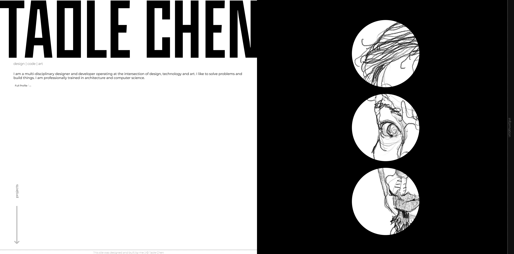
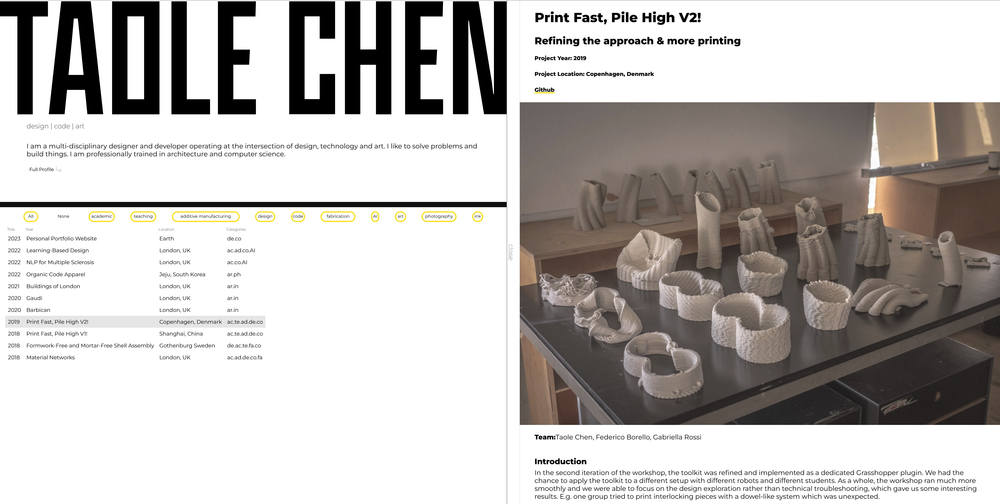

# My Personal Website
## Introduction
This is the source code for my personal website. Please feel free to browse around and leave any feedback!

[Visit Live Website](https://taolechen.com "Taole's Homepage")

## Features
* responsive client-side website
* MVC architecture
* emphasized expandable project structure for future maintainability and smooth user experience.
* unit testing for core library

## Technologies
* HTML
* SCSS
* JavaScript
* Jest
* Webpack
* Figma

## Development
This website is continually being improved. Features will be added and upgraded as I learn more.

Features currently under development:
* Migration to React
* front-end testing
* Separate art section
* content management system for blog section
